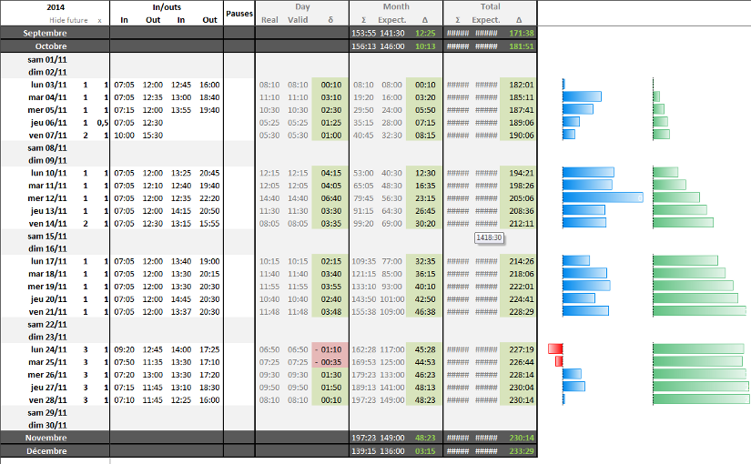

= xls-time-tracker
Cyrille Chopelet <cyrille.chopelet@mines-nancy.org>

// Set your repository informations here.
:github-user: KeyboardPlaying
:github-repo: xls-time-tracker
:waffle: {github-repo}

:url-wiki: https://github.com/KeyboardPlaying/xls-time-tracker/wiki

// The badges. Should not require any change.
image:https://badge.waffle.io/{github-user}/{waffle}.svg?label=ready&title=Ready[Waffle, link="https://waffle.io/{github-user}/{waffle}"]
image:http://img.shields.io/badge/gitter-join_chat_%E2%86%92-1dce73.svg?style=plastic[Join the chat, link="https://gitter.im/KeyboardPlaying/xls-time-tracker?utm_source=badge&utm_medium=badge&utm_campaign=pr-badge&utm_content=badge"]

// Now, the main documentation.

The xls-time-tracker is an Excel sheet designed to help you follow the time you stay at work.

== Notice

See the {url-wiki}[Wiki] to see how to use the time tracker or fork it.

== License

The code for this project is under MIT license.

The icons from the http://tango.freedesktop.org/:[Tango Desktop Project]. Thanks to them for their hard work. and sharing.
