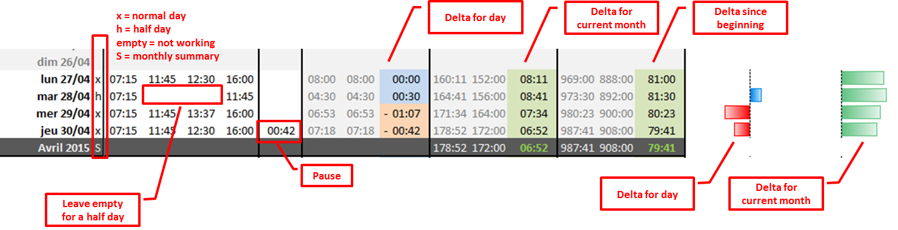
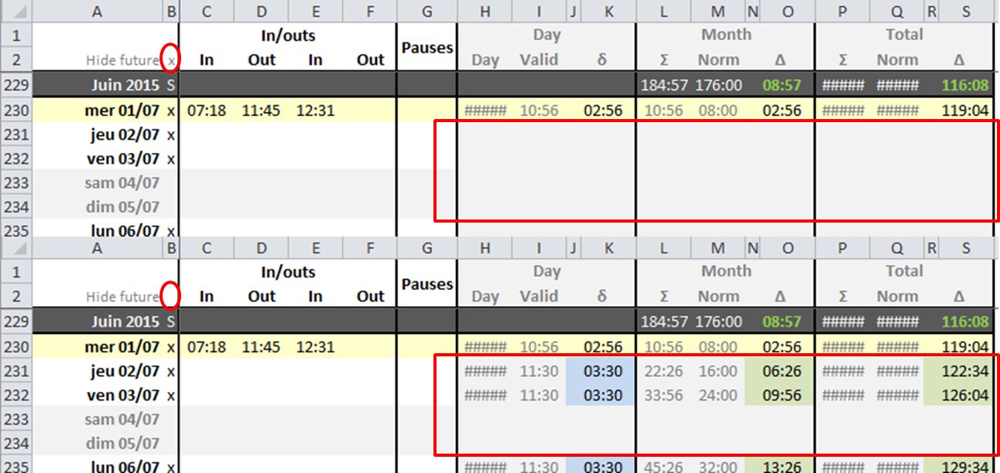

# Notice

If you need to plan ahead and see the future, uncheck B2.

# About the construction

The xlsx file is stored as exploded in `xlsx_deconstructed`. This is a choice to make version control more efficient (tracking a binary does _not_ feel efficient). Modifications are made in the compiled xlsx file, in Excel.

A utility to go from one form to the other is available as a [Java project](https://github.com/cyChop/xls-time-tracker-construct). Once built using Maven, the JAR can be run by double-clicking it. You can then construct the file to edit it in Excel, then deconstruct it to version it.

The project location is stored in preferences. If you wish to clear the preferences from your computer, you can click the `Clear pref.` button.
